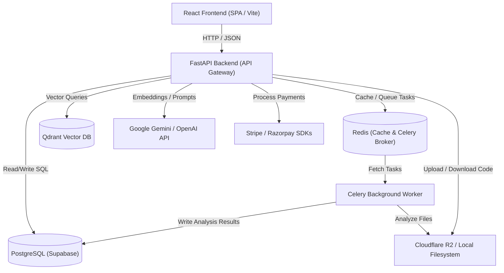
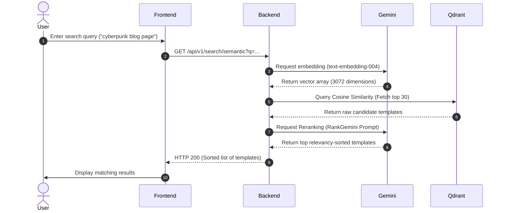
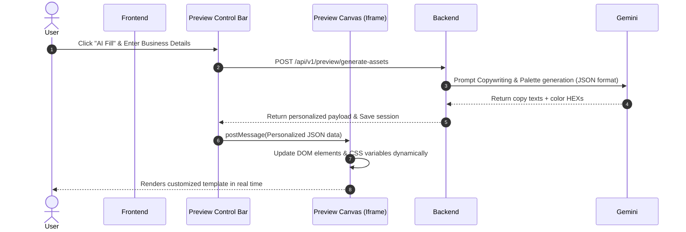
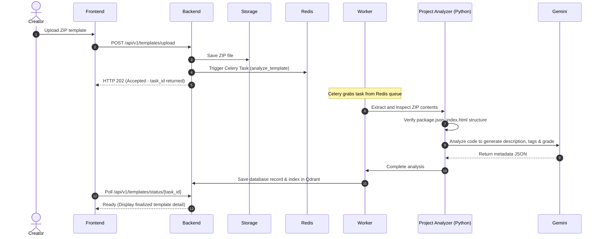

# 2. System Architecture & Flows

This document details the high-level system layout, components, and primary data workflows for **AI Site Studio**.

---

## Technical Component Architecture

The application is structured as a decoupled client-server architecture supported by relational/vector databases, caching structures, and asynchronous task workers:

### Component Details
1. **Frontend SPA**: React application styled with vanilla CSS, managed via Zustand stores. Handles rendering templates within custom sandbox preview structures.
2. **Backend API**: FastAPI application containing REST route boundaries, validation schemes (Pydantic), and database interactions (SQLAlchemy + asyncpg).
3. **Relational Database**: PostgreSQL managing users, standard metadata, preview sessions, payment status, and order tracking.
4. **Vector Database**: Qdrant housing template description embeddings (3072 dimensions) for sub-second semantic searches.
5. **Broker & Task Queue**: Redis managing session caches and driving Celery's background template analyzers.
6. **Object Storage**: Local disk or Cloudflare R2 bucket holding code template archives (ZIP) and screenshot image buffers.

---

## System Workflows

### 1. Semantic Search & RankGemini Pipeline

---

### 2. Live Customization & Preview (AI Fill)

---

### 3. Template Ingestion & Analysis Pipeline

