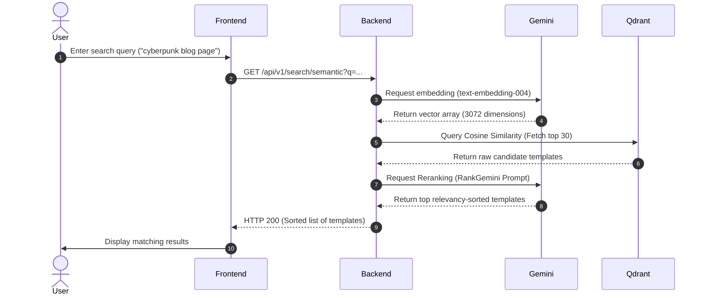
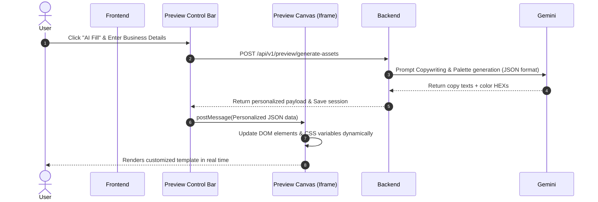

# AI Site Studio: Comprehensive Project Documentation

Welcome to the comprehensive master documentation for **AI Site Studio**, a next-generation, AI-powered website template marketplace. This document consolidates the product vision, architectural design, implementation progress, and future developmental roadmaps into a single source of truth.

---

## 1. Product Vision & Core Idea

### The Core Problem
Traditional web template marketplaces (such as ThemeForest or Templated) sell static source-code packages. This approach suffers from three major paint points:
1. **Discovery Friction**: Buyers must search using rigid keyword queries (e.g., "bootstrap", "portfolio") rather than describing their exact concept, layout, or aesthetic style.
2. **Setup Friction**: Once purchased, buyers must set up local environments, manually swap text blocks and images, and configure styling configurations to determine if the template truly fits their brand.
3. **Creator/Admin Ingestion Bottleneck**: Platform admins must manually verify uploaded zip files to ensure compatibility, evaluate performance metrics, and review accessibility compliance.

### The AI Site Studio Solution
AI Site Studio resolves these points by infusing interactive generative AI directly into the buying, customization, and deployment pipelines:
* **Semantic Vector Discovery**: Users describe the exact website style they want (e.g., *"clean React dashboard for a cybersecurity startup with cyber-neon accents"*) and get matching results immediately.
* **Live Personalization Canvas ("AI Fill")**: Buyers type in their company profile (name, industry, description, brand mood) and see the template's copy and color variables automatically adapt in real-time inside a sandboxed iframe.
* **Automated Quality Ingestion**: Creator uploads are parsed automatically by an AI audit pipeline that checks the project structure, extracts metadata, evaluates performance/accessibility, and recommends code improvements.

```
┌────────────────────────────────────────────────────────┐
│                   AI SITE STUDIO                       │
├───────────────────┬────────────────┬───────────────────┤
│    DISCOVERY      │ CUSTOMIZATION  │     INGESTION     │
│  Semantic Search  │ AI Copywriting │  Automated Zip    │
│  & RankGemini     │ & Palettes in  │  Code Auditing &  │
│  Vector Retrieval │ Secure Canvas  │  Metadata Tagger  │
└───────────────────┴────────────────┴───────────────────┘
```

---

## 2. Requirements Specification

### Functional Requirements
1. **Semantic Template Search**:
   - Generate embeddings for user queries using Gemini (`text-embedding-004`).
   - Query a vector database (Qdrant) to extract templates using cosine similarity.
   - Use LLM-based re-ranking (RankGemini) to refine the top search results.
2. **Interactive Preview Canvas**:
   - Iframe-sandboxed preview environment isolating template scripts.
   - Secure parent-child page communications using `postMessage`.
   - Generative copywriters producing customized headings, body content, and CTAs.
   - Algorithmic color palette generators proposing tailored theme tokens.
3. **Template Ingestion Pipeline**:
   - Codebase analyzers scanning uploaded files to verify index, component structures, and framework configurations (e.g. React, Next.js, Vue, HTML).
   - Rejecting non-frontend scripts (e.g. backend Django, Node APIs).
   - Generative labeling producing SEO tags, summaries, categories, and code optimizations.
4. **Order Management & Licensing**:
   - Stripe and Razorpay checkout processors.
   - Standard and Extended license assignments.

### Non-Functional Requirements
* **Response Latency**: Core semantic search queries must return within 1.5 seconds.
* **Security & Isolation**: The preview canvas must restrict document actions (e.g. cookie extraction, script injections) using `sandbox` directives.
* **Scalability**: Celery async workers should process large zip code analyzers out-of-band to prevent API gateway thread blocking.

---

## 3. Technology Stack & Directory Map

### Technology Stack
* **Frontend Single Page App (SPA)**: React 18, Vite 5, Zustand (State Management), React Router DOM, Framer Motion, Vanilla CSS.
* **Backend API Gateway**: FastAPI (Python 3.12), SQLAlchemy 2.0 (asyncpg driver), Alembic migrations, Pydantic, Celery (background job queues).
* **Databases & Caching**: PostgreSQL (Supabase hosting), Redis (Celery broker, session cache).
* **Vector Store**: Qdrant database storing 3072-dimensional template text embeddings.
* **Generative Models**: Google Gemini (1.5-flash / text-embedding-004), OpenAI (GPT-4o).
* **Image Processing**: Pillow (dynamic watermark overlays on preview screenshots).

### System Directory Map
```
ai-site-studio/
├── docs/                                # Project documentation folder
│   ├── 1_business_concept.md            # Target audience & monetization model
│   ├── 2_system_architecture.md         # Component mapping & flow diagram references
│   └── comprehensive_documentation.md   # [This File] Consolidated project status & docs
├── backend/                             # Python FastAPI REST API backend
│   ├── alembic/                         # Database schema migrations
│   ├── app/
│   │   ├── api/                         # Endpoint Router Modules
│   │   │   ├── auth.py                  # OAuth + JWT auth
│   │   │   ├── templates.py             # Template catalogs & upload handlers
│   │   │   └── search.py                # Vector search endpoints
│   │   ├── core/                        # System config & database adapters
│   │   ├── models/                      # SQLAlchemy ORM Models
│   │   ├── repositories/                # Database abstraction repositories
│   │   ├── schemas/                     # Pydantic models for validation
│   │   ├── services/                    # Core Business & AI logic services
│   │   │   ├── ai_service.py            # LLM copywriting & color palette prompts
│   │   │   ├── preview_service.py       # Pillow watermark overlay builder
│   │   │   ├── project_analyzer.py      # Automated zip scanner & tech auditor
│   │   │   └── search_service.py        # Gemini embedding + Qdrant similarity
│   │   └── tasks/                       # Celery worker background tasks
│   ├── Dockerfile                       # Container definition
│   ├── docker-compose.yml               # Local DB + Redis infrastructure config
│   └── requirements.txt                 # Backend dependencies manifest
└── frontend/                            # React Single Page App frontend
    ├── src/
    │   ├── App.jsx                      # Route configurations
    │   ├── main.jsx                     # Hydration entry point
    │   ├── app/                         # App pages
    │   │   ├── marketplace/             # Template discovery & search views
    │   │   ├── preview/                 # Iframe canvas sandboxed environment
    │   │   └── globals.css              # Styling design tokens & color schemes
    │   ├── components/                  # Re-usable UI elements
    │   ├── hooks/                       # Custom React hooks
    │   └── store/                       # Zustand store modules
```

---

## 4. Key Workflows & Processes

### Semantic Search & RankGemini Pipeline
The search engine utilizes dense vector structures coupled with cognitive LLM re-ranking to yield highly relevant templates:



---

### Live Customization & Preview Canvas (AI Fill)
To personalize templates prior to purchasing, properties are updated dynamically inside a sandboxed iframe using parent-to-child data bindings:



---

## 5. Development Progress: What Has Been Done

### Backend Implementation
* **FastAPI Setup**: Ready with global lifespan controls, CORS configurations, security middlewares, and validation handlers.
* **Authentication Engine**: Custom OAuth modules and JWT authentication databases are in place.
* **AI Copywriter & Palette Generator (`ai_service.py`)**: Structured prompts parse user settings (industry, descriptions) and return JSON blocks with copywriting lines and HEX codes.
* **Project Analyzer (`project_analyzer.py`)**: Zip extraction, file taxonomy indexing, framework audits, security checks, and code metric scoring are operational.
* **Semantic Search (`search_service.py`)**: Seamless vector indexing utilizing Gemini embeddings alongside Qdrant collections. Re-ranking algorithms using RankGemini are integrated.
* **Database Relational Models**: Ready with migrations (Alembic) tracking `users`, `templates`, `preview_sessions`, and `orders`.

### Frontend Implementation
* **Routing & Pages**: Fully configured routes under `frontend/src/app` including marketplaces, preview builders, onboarding pages, checkout layouts, and admin dashboards.
* **State Stores**: Zustand modules handling global user authentication, marketplace filters, and preview sessions.
* **Responsive Layouts**: Premium styling systems constructed using custom Vanilla CSS tokens, dark mode schemes, and Framer Motion micro-animations.

---

## 6. Project Roadmap: What Is Gonna Be Done

### Phase 1: Production Deployment & Infrastructure Hardening
* **Redis Replication**: Establish Redis multi-node clusters to isolate transient cache databases from long-running Celery brokers.
* **Database Connection Pooling**: Set up connection proxies (e.g. pgBouncer) between Supabase PostgreSQL databases and FastAPI workers.
* **Qdrant Cloud Deployment**: Transition Qdrant vector indices from local Docker container endpoints to production instances.

### Phase 3: Feature & AI Model Expansions
* **Figma-to-Code Pipeline**: Enable creators to upload Figma designs and automatically parse them into template files using LLM visual transformers.
* **Automatic Subdomain Publishing**: Allow buyers to purchase a template and launch it instantly to a custom subdomain (e.g., `brand.aisitestudio.com`) using Vercel Project API integrations.
* **Multi-Tenancy Support**: Provide premium subscription models allowing design agencies to house isolated template portfolios for separate client configurations.
* **Advanced AI Personalization Credits**: Launch credit check structures, tracking monthly generative requests across accounts and charging microtransactions upon exhaustion.
